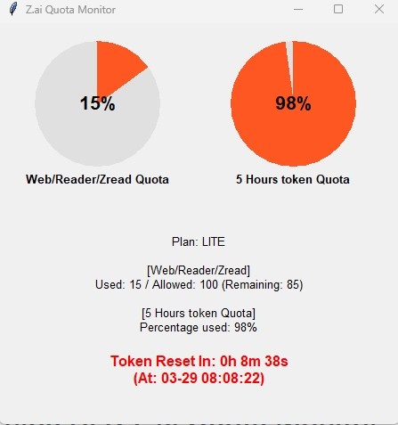

# Zhipu AI & Z.ai Quota Monitor

Zhipu AI 및 Z.ai의 5시간 토큰 사용 한도 및 MCP 월별 할당량을 **실시간으로 조회하는 GUI 모니터링 관리 도구**입니다.
창을 켜두면 매 30초마다 갱신되며, 직관적인 원형 그래프와 초 단위 리셋 카운트다운을 확인할 수 있습니다.

## 파일 구성
* `key/zai.key` : API 키를 설정하는 파일입니다. (직접 폴더 및 파일 생성 필요)
* `query_quota.py` : 할당량을 조회하고 GUI를 띄우는 메인 파이썬 스크립트.
* `run_quota_check.bat` : 클릭 한 번으로 가상환경을 구축하고 파이썬 스크립트를 실행하는 파일입니다.
* `build_exe.bat` : 파이썬 없이 독립적으로 실행할 수 있도록 검은 CMD 창이 안 뜨는 `.exe` 실행 파일로 만들어 주는 빌드 스크립트.

## 사용 방법

1. **API 키 설정**
   * 프로젝트 폴더 내에 `key` 폴더를 만듭니다.
   * `key` 폴더 안에 `zai.key`라는 이름의 텍스트 파일을 생성하고, 발급받은 API 키를 붙여넣어 저장합니다.

2. **할당량 모니터(GUI) 실행하기**
   `run_quota_check.bat` 파일을 더블 클릭하여 실행합니다. 
   - 처음 실행 시 자동으로 Python 가상환경을 생성하고 패키지를 설치합니다.
   - 이후 화면에 항시 띄워지는 GUI 창이 뜨며, 실시간 사용량과 남은 리셋 시간이 표시됩니다.

3. **(추천) 백그라운드 단독 실행 파일(EXE) 만들기**
   매번 검은색 CMD 창이 같이 뜨는 것이 불편하시다면, `build_exe.bat` 파일을 더블 클릭해주세요.
   - 자동으로 필요한 패키지(`pyinstaller`)를 받고, 이 프로그램 폴더 최상단에 바로 **ZaiQuotaMonitor.exe** 단일 실행 파일을 생성합니다. (그리고 불필요한 빌드 부산물들은 바로 삭제됩니다.)
   - 이후에는 생성된 `ZaiQuotaMonitor.exe` 만 실행하면 CMD 창 없이 깔끔하게 모니터링 창만 띄울 수 있습니다! (윈도우 시작프로그램 등에 단축 아이콘을 복사해두기 좋습니다.)

## 요구 사항
* Python 3.x 가 설치되어 있어야 하며 환경변수 경로에 설정되어 있어야 합니다.
